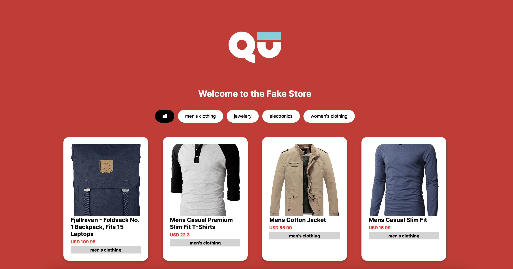

## Getting Started

1) First verify that you have installed the node 18 version in your machine, then "run npm" to install the required node packages.

2) Run "npm run dev" command to have the development server running. 

```bash
npm run dev
# or
yarn dev
# or
pnpm dev
# or
bun dev
```

3) Open [http://localhost:3000](http://localhost:3000) with your browser to see the result.

## Stack
I used the following stack to resolve the challenge.

- ReactJS with Typescript
- Server Side Rendering with Next.js (https://nextjs.org/docs).
- Asyncronus state management with React Query (https://tanstack.com/)
- Internal state handling by useState hook
- Css Styling with Pure Css and inline JS styling.

## Fake API
To have fake data in the project I used the following fake api:
https://fakestoreapi.com/

Its provides a Fake store rest API for e-commerces or shopping website prototypes


